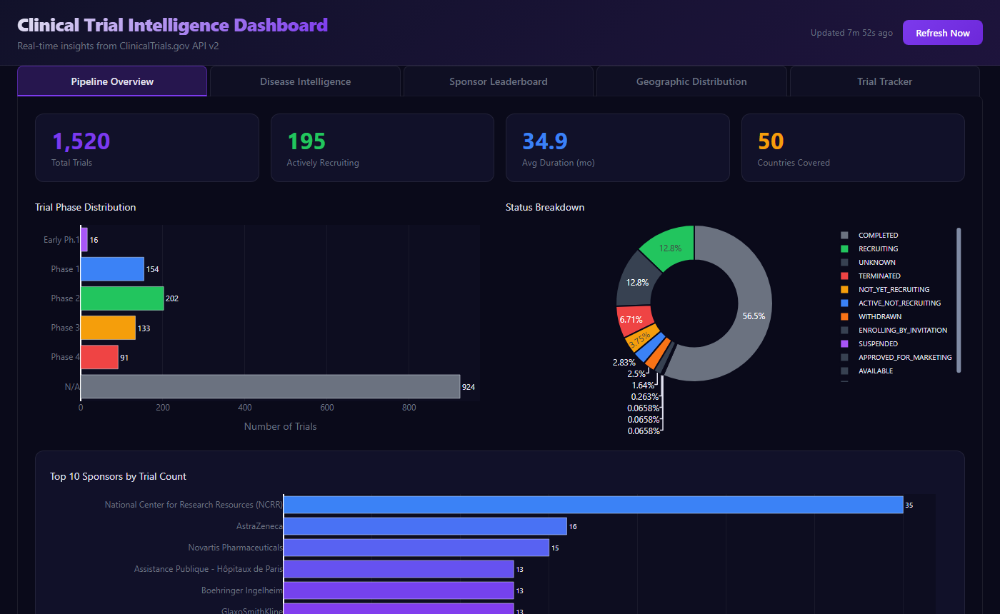
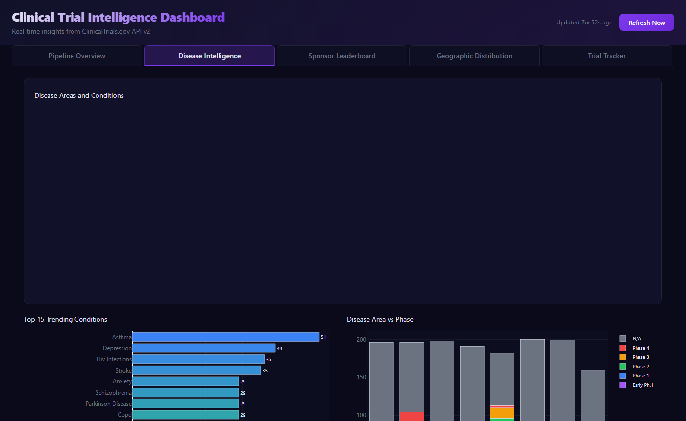
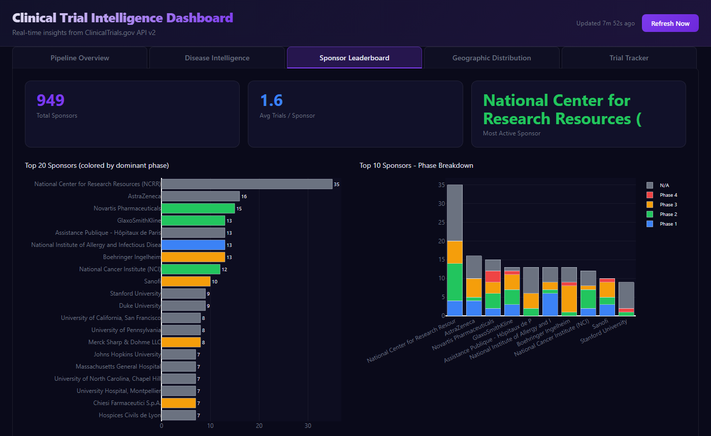
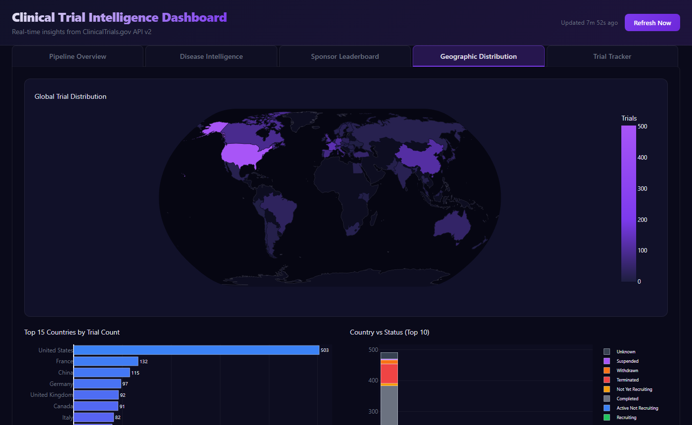
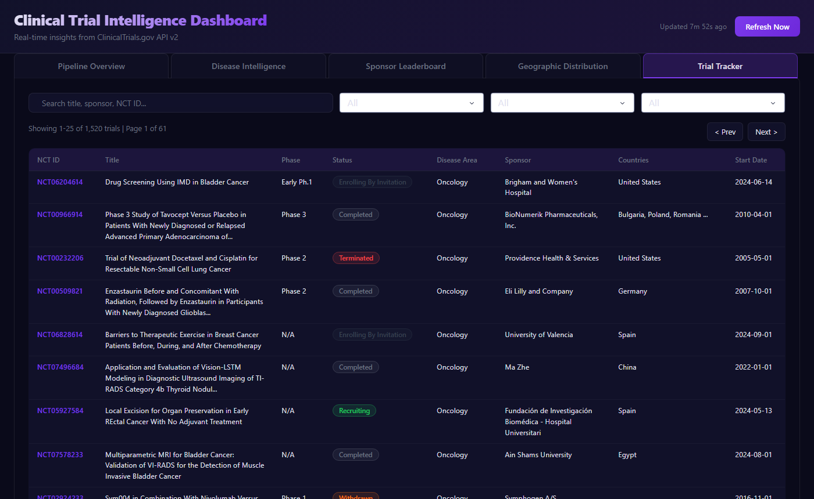

# Clinical Trial Intelligence Dashboard

> Real-time intelligence across 1,500+ clinical trials — live data from ClinicalTrials.gov API v2, spanning 8 disease areas, with phase pipeline tracking, sponsor leaderboards, geographic distribution, and NLP-driven trending conditions.


---

## Screenshots

| Pipeline Overview | Disease Intelligence |
|:-----------------:|:--------------------:|
|  |  |

| Sponsor Leaderboard | Geographic Distribution |
|:-------------------:|:-----------------------:|
|  |  |

| Trial Tracker | |
|:-------------:|-|
|  | |

---

## Features

### 📊 Pipeline Overview
Four KPI tiles — Total Trials, Actively Recruiting, Avg Trial Duration, Countries Covered — plus a phase distribution bar chart (Early Phase 1 through Phase 4), status breakdown donut, and top-10 sponsor bar chart.

### 🧬 Disease Intelligence
Treemap breaking down disease areas into specific conditions by study count, top-15 trending conditions bar chart extracted by NLP keyword frequency from trial titles, and a disease area × phase stacked bar showing which phases dominate each therapeutic area.

### 🏆 Sponsor Leaderboard
Top 20 sponsors ranked by active trial count with dominant phase coloring, sponsor phase breakdown cross-chart (top 10 sponsors × phase), and KPIs for total sponsors, average trials per sponsor, and most active sponsor.

### 🌍 Geographic Distribution
Plotly choropleth world map colored by trial density per country, top-15 countries horizontal bar, and a country × status stacked bar — revealing where trials are running and what stage they're in by region.

### 🔍 Trial Tracker
Fully searchable and filterable table — filter by keyword, status, disease area, and phase simultaneously. Each row shows NCT ID (linked to clinicaltrials.gov), title, phase badge, status badge with color coding, sponsor, countries, and start date. Paginated at 25 rows per page.

---

## Data Coverage

| Disease Area | Query |
|---|---|
| Oncology | cancer, tumor, oncology |
| Cardiovascular | heart disease, cardiovascular, hypertension |
| Neurology | alzheimer, parkinson, multiple sclerosis, stroke |
| Infectious Diseases | HIV, tuberculosis, hepatitis, malaria |
| Diabetes | diabetes, insulin, glycemic |
| Mental Health | depression, anxiety, schizophrenia, bipolar |
| Respiratory | asthma, COPD, pulmonary fibrosis |
| Rare Diseases | rare disease, orphan disease |

Up to **200 trials fetched per disease area** (1,600 total), auto-refreshed every hour via APScheduler.

---

## Tech Stack

| Layer | Technology |
|---|---|
| UI | Plotly Dash 4.x + Dash Bootstrap Components |
| Charts | Plotly 6.x — choropleth, treemap, bar, donut, scatter |
| Data | ClinicalTrials.gov REST API v2 (no auth required) |
| NLP | Keyword frequency extraction with custom stopword list |
| Storage | SQLite — JSON-serialised list columns, 1-table design |
| Scheduler | APScheduler `BackgroundScheduler` — 1-hour refresh |

---

## Quick Start

```bash
git clone https://github.com/OzSpidey/clinical-trial-dashboard.git
cd clinical-trial-dashboard

pip install -r requirements.txt
python dashboard.py
# Open http://localhost:8051
```

The first run fetches ~1,600 trials from ClinicalTrials.gov in the background (takes 1–2 minutes). The UI renders immediately with "Fetching data…" placeholders and populates as each disease area completes.

---

## Project Structure

```
clinical-trial-dashboard/
├── dashboard.py        # Plotly Dash app — 5 tabs, 7 callbacks
├── config.py           # Disease areas, status/phase colors, DB path
├── fetcher.py          # ClinicalTrials.gov API v2 — pagination + extraction
├── store.py            # SQLite layer — upsert, queries, stats
├── scheduler.py        # APScheduler hourly background refresh
├── nlp.py              # Keyword extraction for trending conditions
├── assets/
│   └── dashboard.css   # Dark glassmorphism theme
├── data/               # Auto-created; holds trials.db (gitignored)
└── requirements.txt
```

---

## Data Flow

```
Every hour (APScheduler)
    │
    ├─► fetcher.fetch_all_disease_areas()
    │       └── 8 disease queries × up to 200 results each
    │           pagination via nextPageToken loop
    ├─► store.upsert_trials()
    │       └── INSERT OR REPLACE into SQLite
    └─► scheduler._last_run updated

Dashboard callbacks (on interval tick or user interaction)
    │
    ├─► store.get_trials()       → all tabs (cached DataFrame)
    ├─► store.get_stats()        → KPI tiles
    ├─► nlp.get_trending_conditions()  → Disease Intelligence tab
    └─► Plotly figures computed in-process from SQLite data
```

---

## API Reference

ClinicalTrials.gov v2 endpoint used:
```
GET https://clinicaltrials.gov/api/v2/studies
    ?query.cond=<condition>
    &filter.status=<status>
    &pageSize=100
    &pageToken=<token>   # for pagination
    &format=json
```
No API key, no rate limit documented — polite 0.2s delay between pages.

---

## Requirements

```
dash>=2.14.0
dash-bootstrap-components>=1.4.0
plotly>=5.17.0
pandas>=2.0.0
numpy>=1.24.0,<2.0
requests>=2.31.0
apscheduler>=3.10.1
```

---

## Related Projects

- [Stock Sentiment Dashboard](https://github.com/OzSpidey/stock-sentiment-dashboard) — Real-time NLP sentiment for 15 stocks
- [IPL Analytics Dashboard](https://github.com/OzSpidey/ipl-analytics-dashboard) — 19 seasons of IPL cricket statistics
- [Customer Churn Intelligence Platform](https://github.com/OzSpidey/churn-predictor-dashboard) — XGBoost + SHAP churn prediction

---

*Built with Plotly Dash · ClinicalTrials.gov API · APScheduler*
